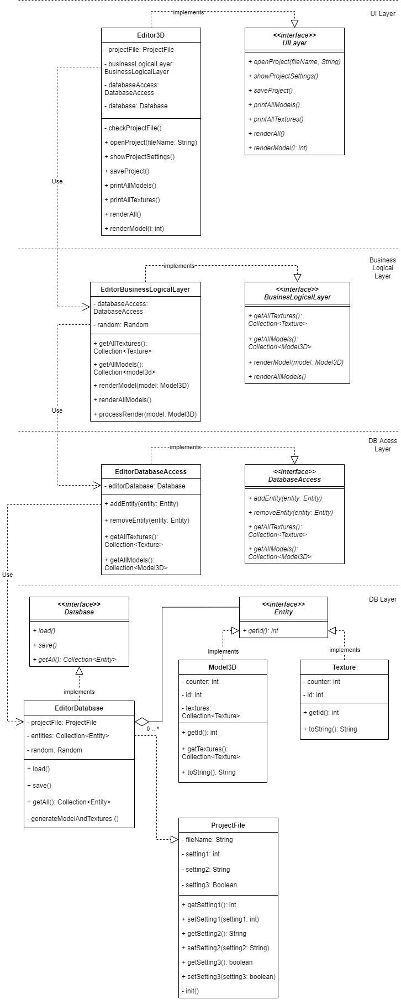

# softwareArchitecturePart5

## UML диаграмма классов



**Вопрос:**  
Мы инициализируем в Editor3D:
```java
@Override
public void openProject(String fileName) {
        projectFile = new ProjectFile(fileName);
        database = new EditorDatabase(projectFile);
        databaseAccess = new EditorDatabaseAccess(database);
        businessLogicalLayer = new EditorBusinessLogicalLayer(databaseAccess);
        }
```
верно ли действие?
```java
database = new EditorDatabase(projectFile);
databaseAccess = new EditorDatabaseAccess(database);
```
Должен ли Editor3D вообще что-то знать о EditorDatabase и EditorDatabaseAccess?   
Или это исключительно для упрощения конкретной задачи?
